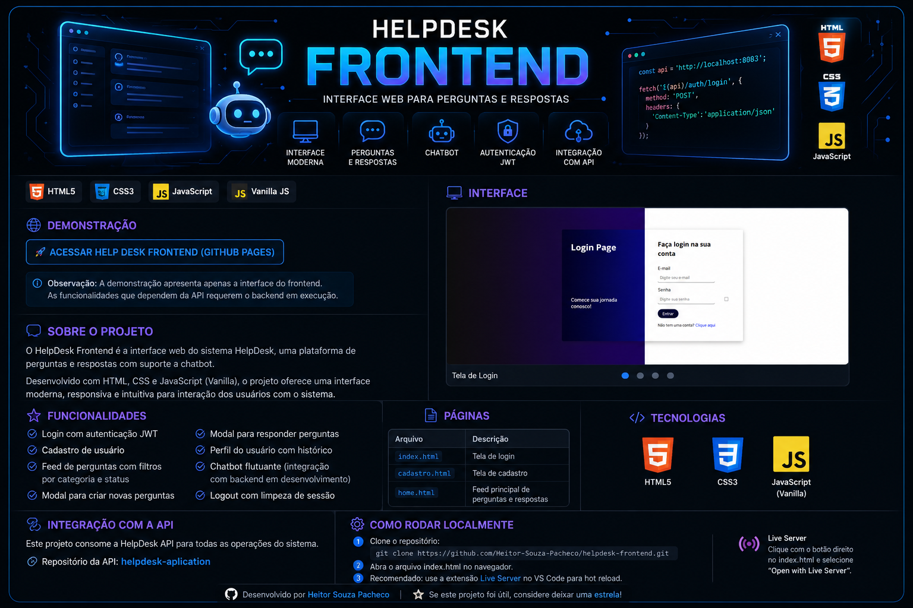

<p align="center">
  
</p>

<p align="center">
  <strong>Interface web para uma plataforma de perguntas e respostas com suporte a chatbot.</strong>
</p>

<p align="center">
  
  
  
  
</p>

---

# 🌐 Demonstração

<p align="center">
  <a href="SEU-LINK-DO-GITHUB-PAGES">
    
  </a>
</p>

> ⚠️ **Observação:** A demonstração online permite visualizar a interface do projeto. As funcionalidades que dependem da API requerem que o backend esteja em execução.

---

# 💬 Sobre o projeto

O **HelpDesk Frontend** é a interface web do sistema HelpDesk, uma plataforma de perguntas e respostas desenvolvida para facilitar a comunicação entre usuários e a resolução de dúvidas.

O projeto foi desenvolvido utilizando **HTML5, CSS3 e JavaScript Vanilla**, sem frameworks frontend, com foco em uma interface moderna, organizada e intuitiva.

A aplicação possui integração com uma **API REST desenvolvida em Java e Spring Boot**, responsável pelo gerenciamento dos dados, autenticação e regras do sistema.

---

# ✨ Funcionalidades

### 🔐 Autenticação

- Login de usuários
- Autenticação utilizando JWT
- Cadastro de novos usuários
- Logout
- Limpeza da sessão

### 💬 Perguntas e respostas

- Feed principal de perguntas
- Filtros por categoria
- Filtros por status
- Criação de novas perguntas
- Respostas às perguntas
- Organização das informações

### 👤 Perfil

- Perfil do usuário
- Histórico de atividades
- Informações relacionadas às perguntas e respostas

### 🤖 Chatbot

- Chatbot flutuante
- Interface preparada para interação com assistente
- Integração com backend em desenvolvimento

---

# 🖥️ Páginas

| Página | Descrição |
|---|---|
| `index.html` | 🔐 Tela de login |
| `cadastro.html` | 📝 Tela de cadastro |
| `home.html` | 💬 Feed principal de perguntas e respostas |

---

# 🎨 Interface

A interface foi desenvolvida buscando combinar simplicidade e organização, permitindo que o usuário navegue entre perguntas, respostas e recursos da plataforma de maneira intuitiva.

### 🔐 Login

<p align="center">
  
</p>

> Caso você ainda não tenha o screenshot salvo como `login-preview.png`, pode remover este bloco por enquanto.

---

# 🛠️ Tecnologias

| Tecnologia | Utilização |
|---|---|
| 🟧 HTML5 | Estrutura das páginas |
| 🎨 CSS3 | Estilização e layout |
| 🟨 JavaScript | Lógica e interatividade |
| ⚡ Vanilla JS | Desenvolvimento sem frameworks |
| 🔗 REST API | Comunicação com o backend |
| 🔐 JWT | Autenticação de usuários |

---

# 🔗 Integração com a API

O frontend consome a **HelpDesk API**, desenvolvida em Java e Spring Boot.

A comunicação entre frontend e backend permite realizar operações como:

```text
┌──────────────────────┐
│   HelpDesk Frontend  │
│                      │
│ HTML + CSS + JS      │
└──────────┬───────────┘
           │
           │ HTTP / REST
           ▼
┌──────────────────────┐
│     HelpDesk API     │
│                      │
│ Java + Spring Boot   │
│ Spring Security      │
│ JWT                  │
└──────────┬───────────┘
           │
           ▼
┌──────────────────────┐
│      PostgreSQL      │
└──────────────────────┘
```

### ⚙️ API utilizada

**Repositório:**  
[HelpDesk API](https://github.com/Heitor-Souza-Pacheco/helpdesk-aplication)

---

# ⚙️ Configuração da API

A URL da API está centralizada em:

```text
assets/js/global/api.js
```

Atualmente:

```javascript
const API_BASE_URL = 'http://localhost:8083';
```

Para utilizar uma API hospedada em outro ambiente, altere a URL para o endereço correspondente.

---

# 🚀 Como executar

## 1. Clone o repositório

```bash
git clone https://github.com/Heitor-Souza-Pacheco/helpdesk-frontend.git
```

Entre na pasta:

```bash
cd helpdesk-frontend
```

---

## 2. Execute o frontend

Por ser um projeto desenvolvido com **HTML, CSS e JavaScript puro**, não é necessário instalar dependências através de npm.

Você pode simplesmente abrir:

```text
index.html
```

no navegador.

### ⭐ Recomendado: Live Server

Para uma melhor experiência durante o desenvolvimento, recomenda-se utilizar a extensão **Live Server** no VS Code.

1. Instale a extensão **Live Server**.
2. Abra o projeto no VS Code.
3. Clique com o botão direito em `index.html`.
4. Selecione **Open with Live Server**.

---

# 📁 Estrutura do projeto

```text
helpdesk-frontend/
│
├── assets/
│   ├── css/
│   │   └── ...
│   │
│   ├── js/
│   │   ├── global/
│   │   │   └── api.js
│   │   └── ...
│   │
│   └── helpdeskfrontbanner.png
│
├── index.html
├── cadastro.html
├── home.html
└── README.md
```

---

# 🧠 Conceitos praticados

Durante o desenvolvimento foram trabalhados conceitos como:

- Estruturação de páginas com HTML5
- Estilização com CSS3
- Manipulação do DOM
- JavaScript Vanilla
- Eventos e interações
- Modais
- Formulários
- Gerenciamento de sessão
- Autenticação JWT
- Requisições HTTP
- Consumo de API REST
- Organização de arquivos frontend
- Integração entre frontend e backend
- Desenvolvimento de interfaces web

---

# 📚 Aprendizados

O desenvolvimento deste projeto proporcionou experiência prática na criação de uma aplicação frontend completa utilizando tecnologias web fundamentais.

Entre os principais aprendizados estão:

- Construção de interfaces utilizando HTML e CSS.
- Desenvolvimento de funcionalidades com JavaScript.
- Consumo de APIs REST.
- Integração com autenticação JWT.
- Manipulação de dados recebidos do backend.
- Organização de código frontend.
- Criação de interfaces interativas.
- Comunicação entre frontend e backend.
- Desenvolvimento sem dependência de frameworks.

---

# 🔮 Próximos passos

- [ ] Finalizar integração do chatbot com o backend.
- [ ] Melhorar responsividade para dispositivos móveis.
- [ ] Adicionar animações e microinterações.
- [ ] Melhorar feedback visual das requisições.
- [ ] Adicionar tratamento de erros mais detalhado.
- [ ] Melhorar acessibilidade.
- [ ] Adicionar documentação visual das telas.

---

# 🔗 Projetos relacionados

O HelpDesk é composto por diferentes partes:

### 🖥️ Frontend

Este repositório.

**HTML + CSS + JavaScript**

### ⚙️ Backend

[HelpDesk API](https://github.com/Heitor-Souza-Pacheco/helpdesk-aplication)

**Java + Spring Boot + JWT + PostgreSQL**

---

# 👨‍💻 Desenvolvedor

## Heitor Souza Pacheco

Estudante do Ensino Médio Técnico em Informática, interessado em desenvolvimento de software e tecnologias backend e frontend.

<p align="center">
  <a href="https://github.com/Heitor-Souza-Pacheco">
    
  </a>
  <a href="https://linkedin.com/in/heitor-souza-pacheco">
    
  </a>
</p>

---

<p align="center">
  ⭐ Se este projeto foi útil ou interessante, considere deixar uma estrela!
</p>
